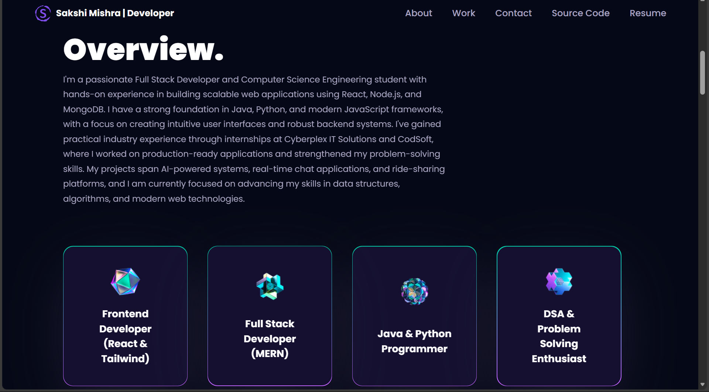
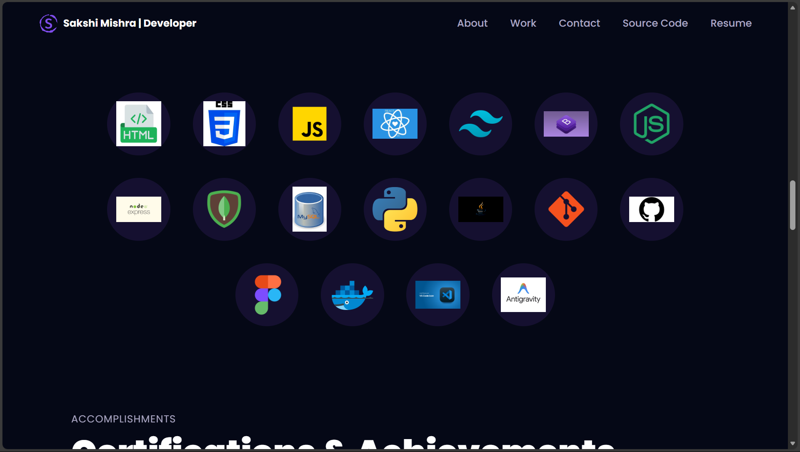
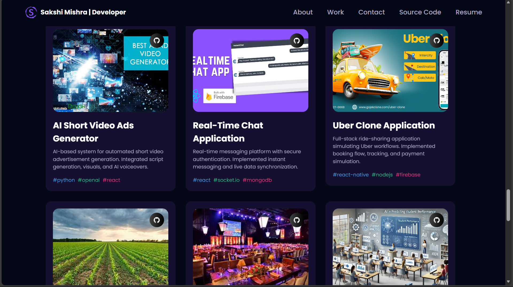
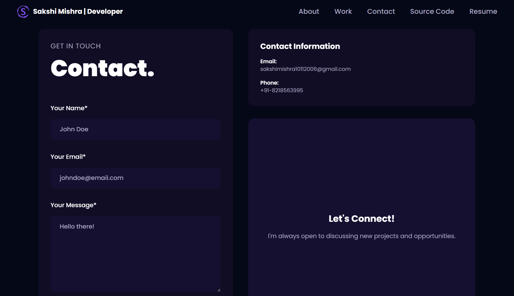

# Portfolio — Sakshi Mishra

A modern 3D portfolio website showcasing my projects, skills, work experience, and contact details. Built with React, TypeScript, and Three.js to create an immersive and interactive user experience.

## Tech Stack

- **React** - Component-based UI library
- **TypeScript** - Type-safe JavaScript
- **Three.js** - 3D graphics and animations
- **Tailwind CSS** - Utility-first CSS framework
- **Framer Motion** - Animation library for React
- **Vite** - Fast build tool and development server

## Features

- Interactive 3D models and animations
- Smooth scroll animations and transitions
- Fully responsive design for all devices
- Dynamic project showcase section
- Work experience timeline
- Functional contact form with email integration
- Modern and clean user interface

## Screenshots

### Hero Section

*Interactive 3D hero section with smooth animations and dynamic background*

### About Section

*Overview showcasing my expertise in Frontend, Full Stack Development, and problem-solving*

### Tech Stack

*Technologies and tools I work with - React, Node.js, Python, MongoDB, and more*

### Projects Showcase

*Featured projects including AI Video Generator, Real-Time Chat App, and Uber Clone*

## How to Run Locally

1. Clone this repository:
```bash
git clone <repository-url>
cd 3d-portfolio-main
```

2. Install dependencies:
```bash
npm install
```

3. Create a `.env` file in the root directory and add your EmailJS credentials:
```env
VITE_APP_SERVICE_ID=your_service_id
VITE_APP_TEMPLATE_ID=your_template_id
VITE_APP_EMAILJS_KEY=your_public_key
VITE_APP_EMAILJS_RECIEVER=your_email@example.com
```

4. Start the development server:
```bash
npm run dev
```

5. Open your browser and navigate to `http://localhost:5173`

## Customization Note

This is my personal portfolio website representing my skills, projects, and professional journey. Feel free to explore the code and use it as inspiration for your own portfolio.
